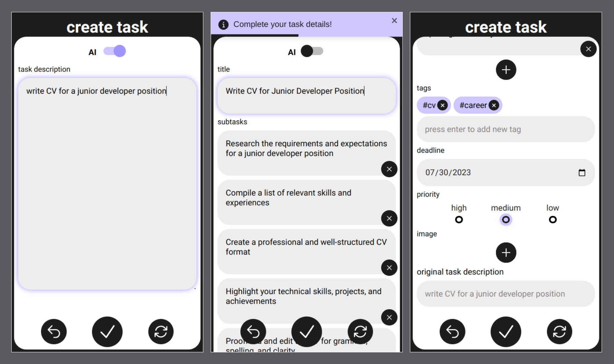

# taskifAI - AI powered task management app

taskifAI is your personal assistant, transforming the way you manage tasks. powered by artificial intelligence, it optimizes your daily activities for unparalleled productivity. simply describe your tasks, and taskifAI will generate a comprehensive to-do list in seconds. experience a new level of efficiency like never before!

## technologies used:

- React
- Next.js
- MongoDB
- Git
- npm
- OpenAI API
- LangChain
- Cloudinary
- Jest
- React Testing Library
- SWR
- mongoose
- React Hooks

## setup taskifAI in your own dev environment:

- clone this repository
- install all dependencies with $ npm install
- create Cloudinary, OpenAI and MongoDB Atlas accounts
- create .env file in the root directory and insert enviroment variables in it:
  - MONGODB_URI
  - OPENAI_API_KEY
  - CLOUDINARY_SECRET
  - CLOUDINARY_API_KEY
  - CLOUDINARY_CLOUD_NAME
- run app in dev mode with $ npm run dev
- server: http://localhost:3000/
- run tests via $ npm run test
